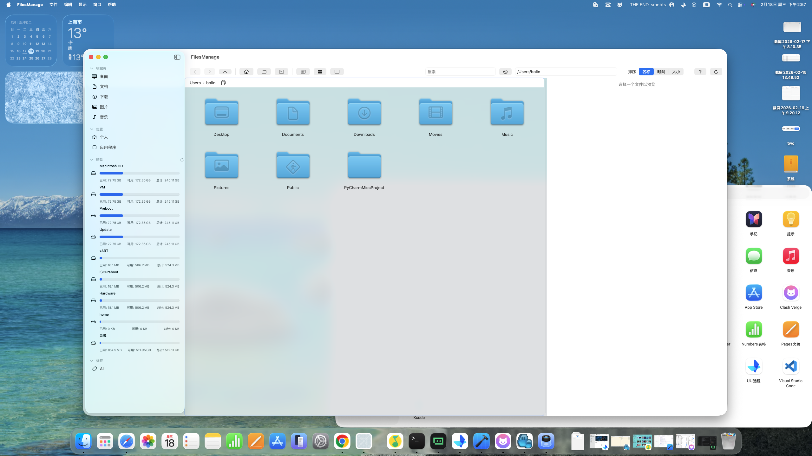
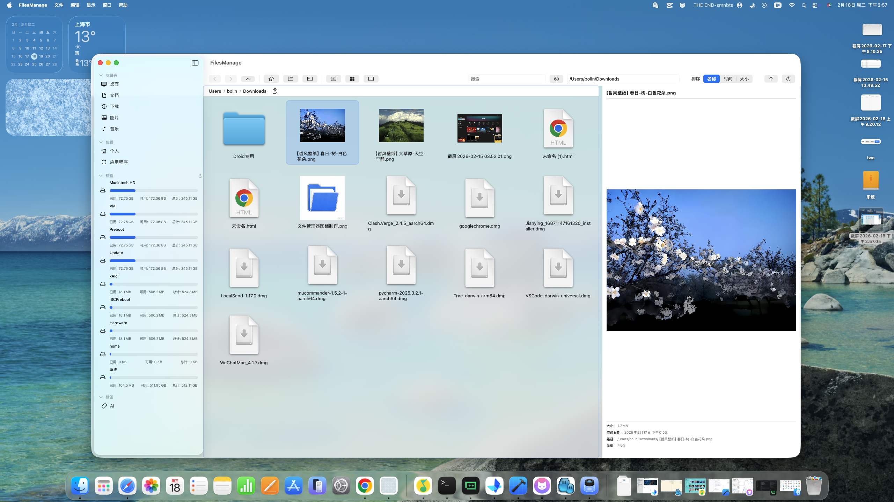
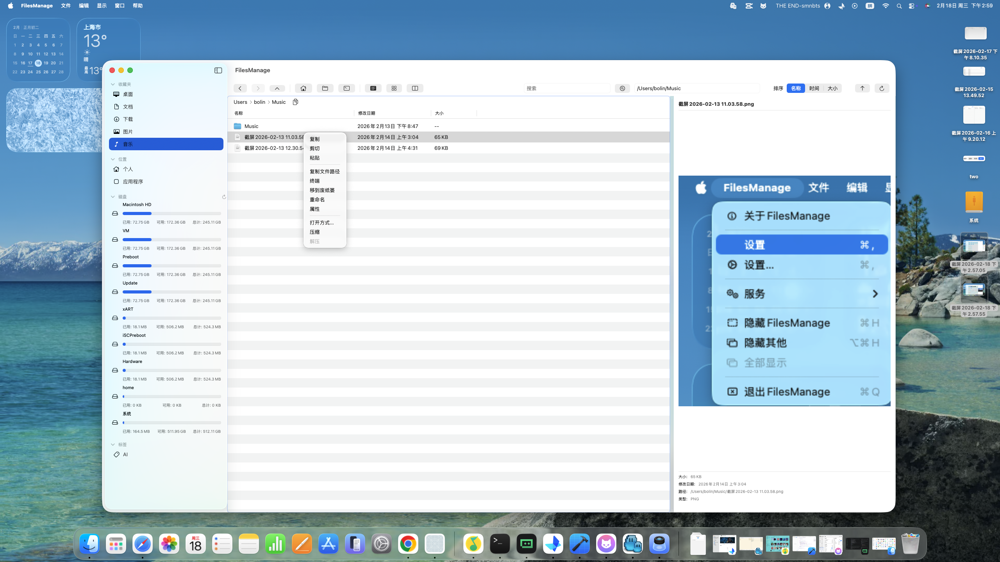

Language: [English](./README.en.md) | [简体中文](./README.md)

# MacOS File Manager

A clean and efficient local file manager supporting dual-pane browsing, quick terminal opening, disk information view, context menu operations, and file preview.

## UI Preview

- Overall view  

- Preview view  

- Context menu  

## Features

- Dual-pane browsing: view and operate two directories side by side
- Quick terminal: open a terminal via context menu or top menu
- Disk information: view disks and partitions
- Context menu: entry for common file operations
- File preview: quick preview for common file types

## Keyboard Shortcuts

- Shift + Click: multi-select
- Command + Click: multi-select
- Command + A: select all
- F5: refresh
- Delete: delete

## Tips

- Dual-pane layout helps compare and operate across directories
- Use the context menu and top menu for common actions
- Press F5 if the interface does not update in time

## Install & Build

- Install Xcode from the Mac App Store
- Open the project `FilesManage.xcodeproj` in Xcode
- Select the `FilesManage` scheme and click Run (⌘R) to build and run
- For DMG/PKG packaging or more details, see [Build_README.md](./Build_README.md)
